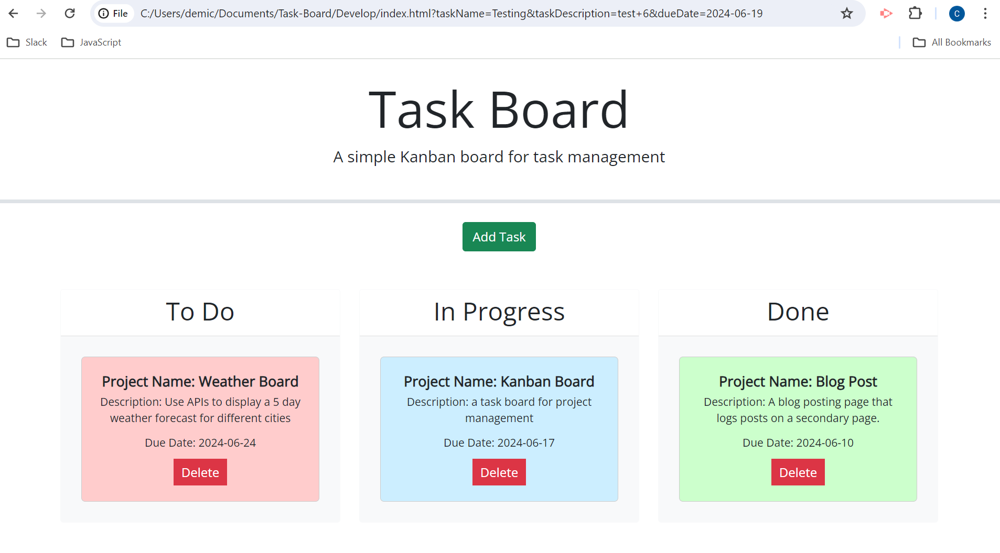

# Task-Board

## A simple Kanban board for task management.
In this project I was tasked with adding to exisiting code to create a fully functional user friendly Kanban Board for task managment. I used jQuery for javascript logic and added CSS for styling. 
## Proceses and Challenges 

```
FIRST I added to exisiting HTML to create a modal for data entry.
THEN I added a function to create a unique task ID.
THEN I added a function to create a task card and add elements dynamically.
THEN I added a function to delete task card with a click, and make cards draggable.
THEN I added a function that adjusts cards color and status based on what lane they are placed in.
THEN I added an event listener to collect data from modal and store in local storage.
THEN I added an event listener to close and hide modal.
THEN I added a function to , render the task list,  and make the due date field a date picker when the page loads.


```
## Deployed Website Screenshot




## Project URL
https://demichele-c.github.io/Task-Board/

